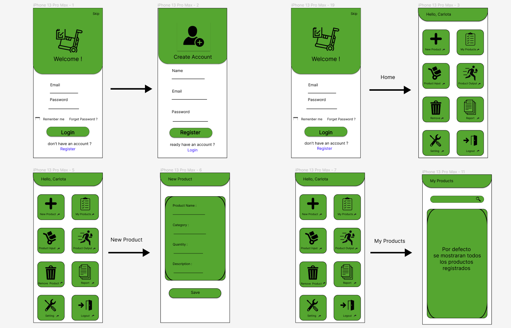
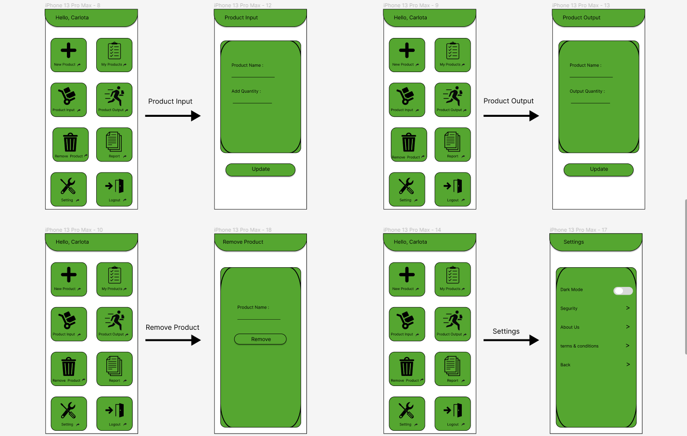
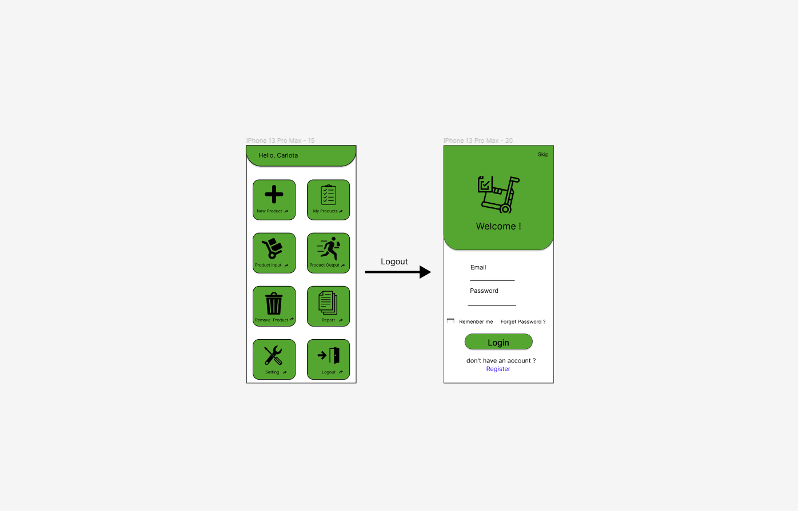
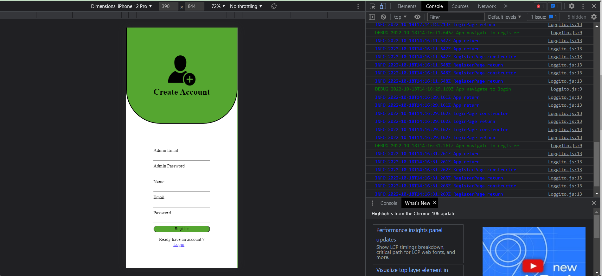
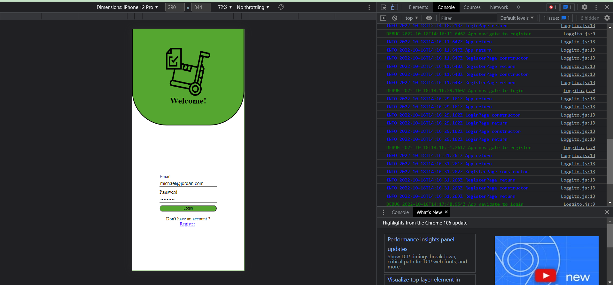
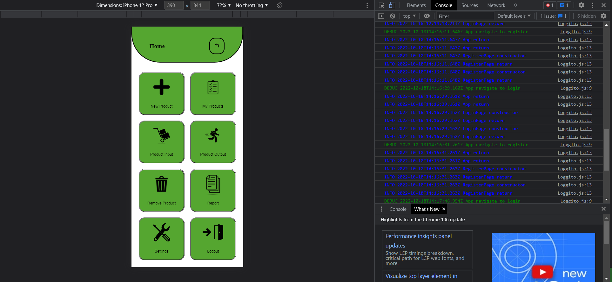
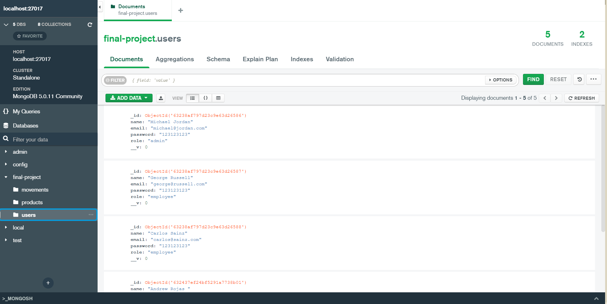
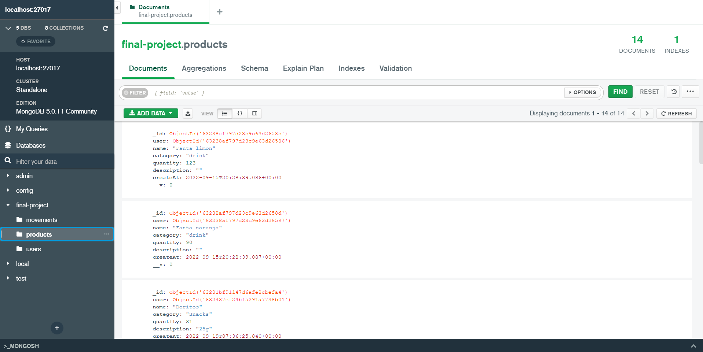
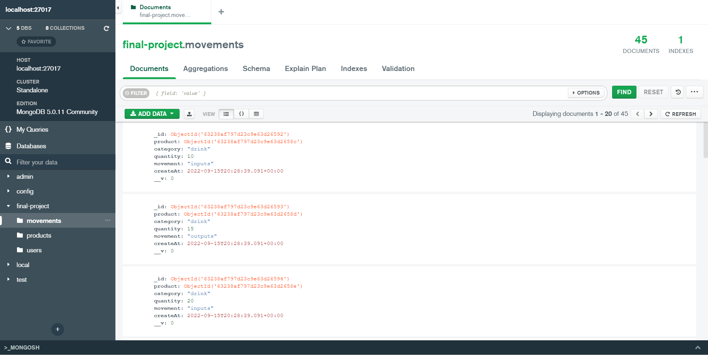

# Name aplication:
  Inventary App

## Description App

  The project aims to develop an inventory management application, the application can only be accessed from a Mobile or Smartphone by a Group/Department/authorized worker. Paper today is quite insecure, paper files stored in filing cabinets present a high security risk, which is why the purpose of Inventory App is to control inventories in an orderly manner, digitizing all the information and making the process faster and safer.

  The digitization of inventory information allows authorized personnel to access the data that has been stored, knowing the available stock of the items that are in the warehouse.

--español--

  El proyecto tiene como objetivo desarrollar una aplicacion de gestion de inventarios, se podra acceder a la aplicacion desde un Movil o Smartphone solo un Grupo/Departamento/trabajador autorizado. El papel hoy en dia es bastante inseguro, los archivos en papel almacenados en archivadores presentan alto riesgo de seguridad, es por ello que el fin de Inventary App es llevar el control de inventarios de una manera ordenada, digitalizando toda la informacion y haciendo el proceso mas rapido y seguro.

  La digitalizacion de informacion de inventarios, permite al personal autorizado acceder a los datos que se han almacenado, conociendo el stock disponible de los articulos que se encuentran en el almacen.

## Functional Description

-Use Cases
  - Register User
  - Login
  - Create Product
  - Product Input
  - Product Output
  - Report
  - Settings

  
## UI design 

## Data Model

User
- User id
- Name
- Email
- Password

Create Product
- Product name
- Category
- Quantity
- Description

Product Input and Output
- Product name
- Add Quantity

## Technical Description

- Blocks
- Sequence
- Components

## Technologies

- MongoDB
- NodeJS
- Express

- Jest

## Roadmap 0 

- DONE figma 
- DONE data model
- TODO figma to react
- DONE data model to mongoose
- DONE implement Populate
- DONE implement users logic
- DONE implement users api routes

Sprint 1

- Sort all folders and spaces to be easier to access files/modules.
- Download the react.
- Identify which are the libraries that are going to be used.
- Install libraries (you have to land more this knowledge and its operation).
- Create Functional Diagram

--español--

- Ordenar todas las carpetas y espacios para poder ser mas facil acceder a los archivos/modulos.
- Descargar el react.
- Identificar cuales son las librerias que se van a utilizar.
- Instalar librerias (hay que aterrizar mas este conocimiento y su funcionamiento).
- Crear Diagrama Funcional 

Sprint 2

- Make a simple Login/Register page in the APP.
- Define the data model to use USER.
- Create an administrator user (who is the one who creates the users)
- Perform User Logic (register/authenticate/retrieve).
- Test the logics with jest
- Join the API with the APP to have the User.

--español--

- Hacer en la APP una pagina de Login/Register sencillas.
- Definir el modelo de datos a utilizar USER.
- Crear un Usuario administrador (que sea quien cree los usuarios)
- Realizar la Logica de User (register/authenticate/retrieve).
- Testear con jest las logicas 
- Unir la API con la APP para tener el User.

Sprint 3

- APP Make a HOME page, and only place in it the things that will be repeated in the other pages (HEADER/FOOTER).
- APP create the components that the app will handle. (create and test them in home, then pass them to Components).
- APP create the routes that take you from Home to each of the components.
- Make the diagram on the web
- Work on the BACK button

--español--

- APP Hacer una pagina de HOME, y solo colocar en el las cosas que se repetiran en las demas paginas (HEADER/FOOTER).
- APP crear los componentes que manejara la app. (crearlos y probarlos en la home, luego pasarlos a Componentes).
- APP crear las rutas que te lleven de Home a cada uno de los componententes.
- Hacer el diagrama en la web
- Trabajar en el boton de BACK 

Sprint 4

- Cosas Realizadas

## NoteApp Version 1.0.0

-Check Out
- Siempre revisar el Doc. y asegurarte de que actualizastes los avances
- Constantemente hacer pruebas de las logicas en insomnia.
- Ir trabajando poco a poco las Logicas en la API
- Revisar siempre que se se suban las actualizaciones del trabajo en el repositorio (GITHUB)